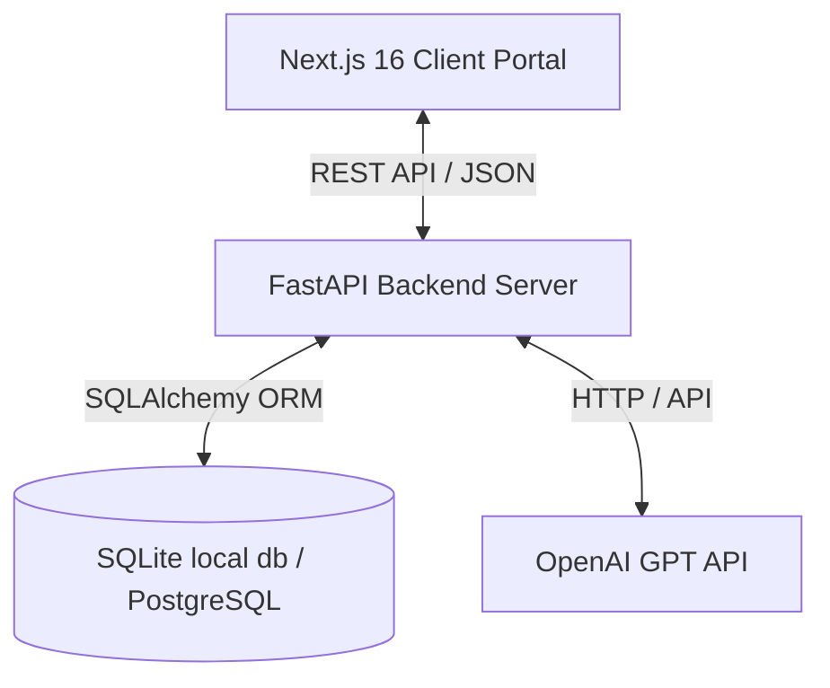

# Functional Requirements Document (FRD)
## Smart Tender Copilot — Indusnet AI Enterprise Solutions

---

## 1. System Architecture & Technical Specifications

### 1.1 Technology Stack
* **Frontend**: Next.js 16 (App Router, TypeScript), Tailwind CSS v4, Base UI, Framer Motion
* **Backend**: FastAPI, Python 3.11, Uvicorn, SQLAlchemy ORM
* **Database**: SQLite (Local Dev / Prototyping), Supabase/PostgreSQL (Production)

---

## 2. Functional Requirements & Module Breakdown

### 2.1 User Authentication & RBAC (Role-Based Access Control)
* **FR-1.1**: The system must authenticate users using JSON Web Tokens (JWT) signed using HS256 algorithm.
* **FR-1.2**: Two roles must be supported: `bidder` and `internal_evaluator`.
* **FR-1.3**: Bidders must belong to a registered company (`bidding_companies` table).
* **FR-1.4**: Bidders can only view their own company's active bid sessions.
* **FR-1.5**: Evaluators can view all bid sessions, scores, and comparative matrices across all companies.

### 2.2 Tender Management (Admin / Evaluator)
* **FR-2.1**: Evaluators can publish a new tender by providing a Title, Description, and a raw RFP document.
* **FR-2.2**: The backend must extract structured requirements from the uploaded document using an LLM to generate a `requirement_matrix` JSON.
* **FR-2.3**: Each requirement in the matrix must have an ID, Name, Description, and Category (e.g., Technical, Financial, Compliance).

### 2.3 Bidding Workspace (Bidder Chat Copilot)
* **FR-3.1**: Bidders can initiate or resume a bid session for any active Tender.
* **FR-3.2**: The workspace must provide a chat interface allowing bidders to converse with the Copilot Agent.
* **FR-3.3**: The Copilot Agent must evaluate the bidder's answers against the `requirement_matrix` checklist.
* **FR-3.4**: When the bidder satisfies a checklist requirement, the state of the checklist (`extracted_data` JSON) must update, and the overall `compliance_score` must be recalculated and saved in real-time.
* **FR-3.5**: A bidder can formally submit their proposal, freezing the session state.

### 2.4 Evaluator Dashboard & Comparison Matrix
* **FR-4.1**: Evaluators can view a side-by-side **Comparative Evaluation Matrix** mapping all bids for a given tender.
* **FR-4.2**: The dashboard must display:
  - Bidder Name and Registration Number.
  - Overall Compliance Score.
  - Compliance checklist completion breakdown.
* **FR-4.3**: Evaluators can download the comparative evaluation matrix as a `.csv` file.

---

## 3. Database Schema Design (Data Models)

### BiddingCompany
* `id` (UUID, PK)
* `name` (VARCHAR)
* `registration_number` (VARCHAR, Unique)
* `created_at` (TIMESTAMP)

### PortalUser
* `id` (UUID, PK)
* `email` (VARCHAR, Unique, Indexed)
* `password_hash` (VARCHAR)
* `role` (VARCHAR: 'bidder' or 'internal_evaluator')
* `company_id` (UUID, FK -> BiddingCompany)
* `name` (VARCHAR)

### Tender
* `id` (UUID, PK)
* `title` (VARCHAR)
* `description` (TEXT)
* `requirement_matrix` (JSON) — List of criteria requirements.
* `status` (VARCHAR: 'open' or 'closed')

### BidderSession
* `id` (UUID, PK)
* `tender_id` (UUID, FK -> Tender)
* `company_id` (UUID, FK -> BiddingCompany)
* `user_id` (UUID, FK -> PortalUser)
* `status` (VARCHAR: 'in_progress', 'submitted', 'evaluated')
* `compliance_score` (NUMERIC)

### ChatHistory
* `id` (UUID, PK)
* `session_id` (UUID, FK -> BidderSession)
* `sender` (VARCHAR: 'user' or 'agent')
* `message` (TEXT)
* `extracted_data` (JSON) — State of checklist completion.

---

## 4. Non-Functional Requirements (NFRs)

### 4.1 Accessibility (WCAG 2.1 AA)
* **NFR-1.1**: The interactive elements must support keyboard navigation (Tab, Enter, Space) and show clear focus indicators.
* **NFR-1.2**: All images and icons must have appropriate `aria-label` or `aria-hidden` tags.
* **NFR-1.3**: The UI must maintain a contrast ratio of at least 4.5:1 for normal text.

### 4.2 Security
* **NFR-2.1**: Passwords must be hashed using bcrypt before database storage.
* **NFR-2.2**: API requests to backend routers (`/auth` and `/tenders`) must be validated using JWT bearer tokens.

### 4.3 Reliability & Availability
* **NFR-3.1**: The local background runner should run independently of the IDE, utilizing system startup triggers (`install-startup.bat`) and silent VBScript background tasks.
